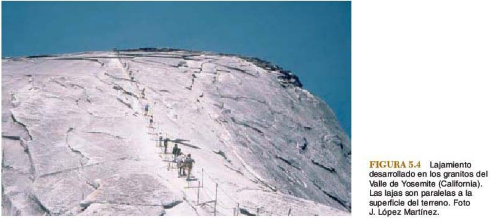
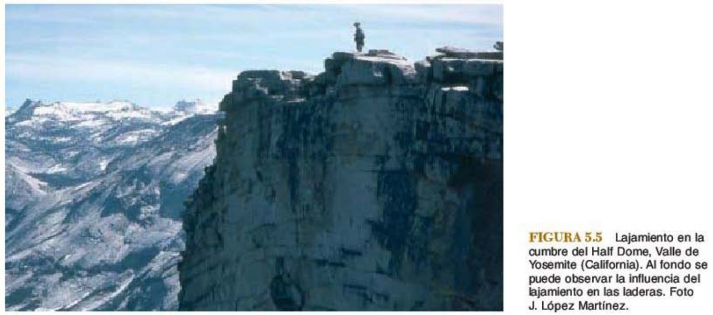
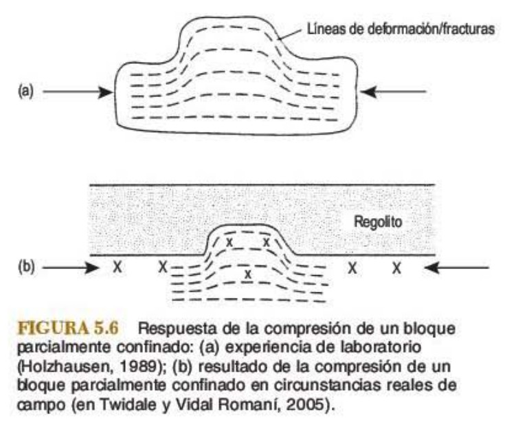
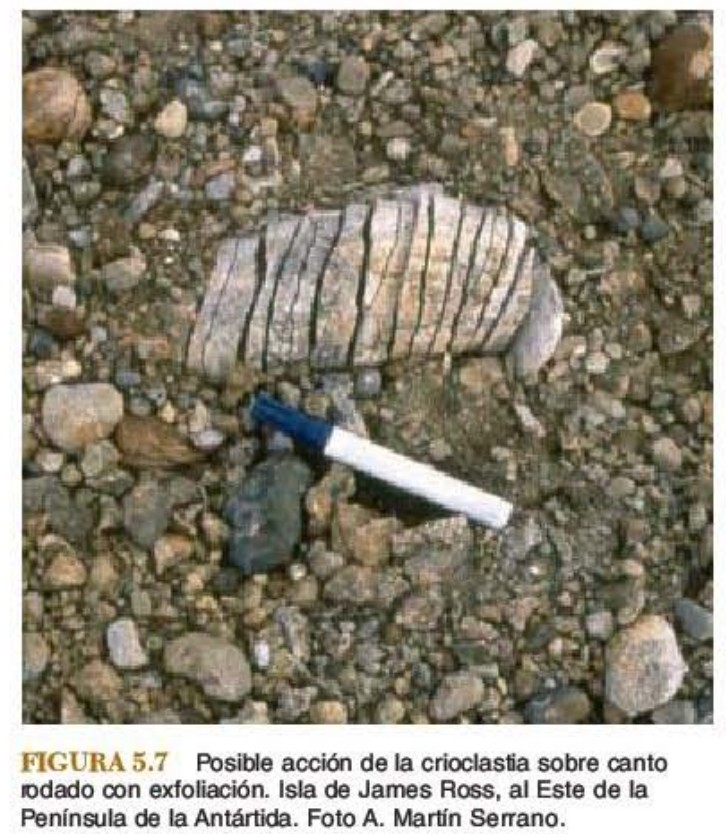
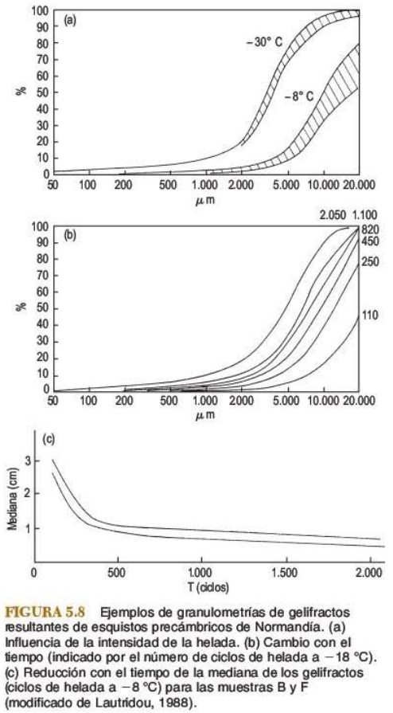
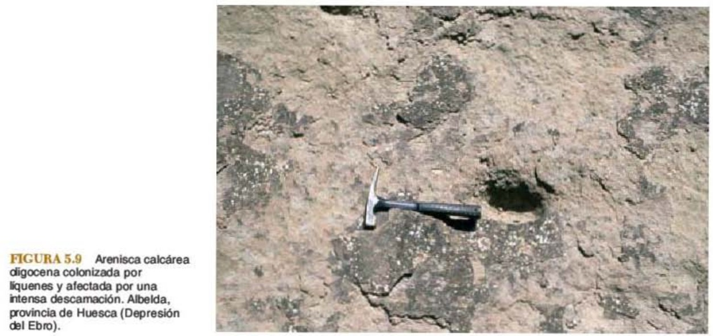
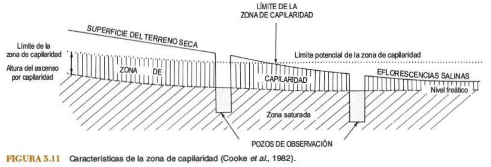
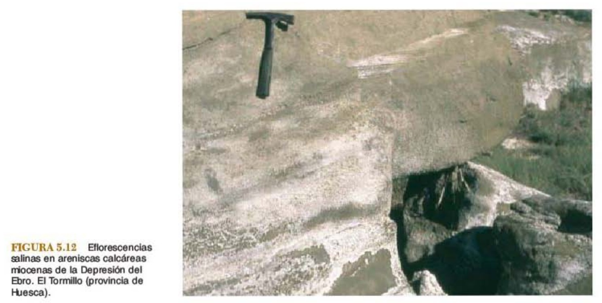
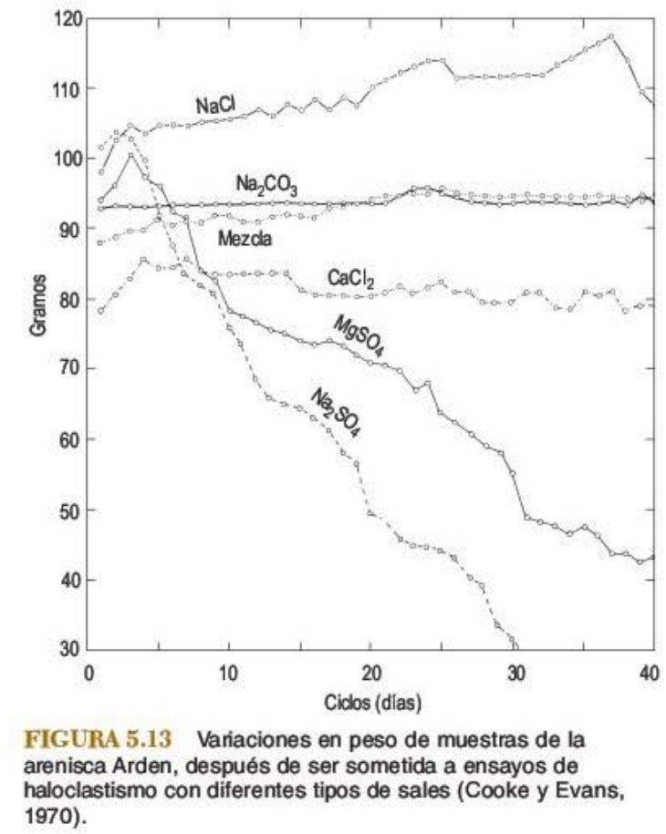

```{r setup, include=FALSE}
knitr::opts_chunk$set(echo = FALSE)
```

# Guión

##

* Tipos y procesos de meteorización

    * Meteorización física
    * Meteorización biológica
    * Meteorización química

* Formas resultantes de la meteorización

* Aspectos prácticos de la meteorización

    * Procesos y productos de alteración
    * Yacimientos y placeres
    * Regolito
    * Monumentos

# Tipos y procesos de meteorización

## Meteorización física

### Lajamiento o *sheeting*

* Las rocas, al __descomprimirse__, experimentan diaclasado paralelo a la topografía, denominado lajamiento

* __Losas arqueadas__ de hasta 10 m de potencia

* El lajamiento __corta las estructuras__ del substrato, __postdatan__ la consolidación de la roca afectada

## 
@gutierrez2008geomorfologia

## 
@gutierrez2008geomorfologia


##

* __Espaciado del diaclasado__:

    * Interpretación __exógena__: se produce por __termoclastia, meteorización química y relajamiento__ por pérdida de carga, diaclasado topográfico
    * Interpretación __endógena__: a __esfuerzos__ desarrollados durante el __emplazamiento__ del granito antes de su enfriamiento o intrusiones, o compresión lateral

## Meteorización física (cont.)

### Crioclastia

* Dominio __periglaciar__

* Además = gelivación | geilfracción

* El agua al __congelarse aumenta su volumen ~9%__ y la roca se rompe cuando se supera la resistencia a la tensión. 

## 
@gutierrez2008geomorfologia

## 
@gutierrez2008geomorfologia

##

* La acción del agua helada normalmente __no ocurre en confinamiento total__

* La __cubierta vegetal__ protege de la crioclastia, mientras que en ausencia de ésta se produce una mayor actividad

* Es un importante agente geomorfológico en el dominio glaciar y periglaciar

* Su mayor efecto ocurre en __primavera__

* Campos y laderas bloques con __gelifractos__ (clastos angulosos productos de la crioclastia)

* __Retroceso escarpes__ entre 0,3 mm/año y 2,5 mm/año

* __Ígneas__ resisten más que las físiles, como la __pizarra__

## 
@gutierrez2008geomorfologia

## Meteorización física (cont.)

### Termoclastia

* Las __variaciones de temperatura__ que experimenta una roca dan lugar a __dilataciones y contracciones__ que pueden llevar a la rotura de la misma

* En el dominio semiárido, es común el calor de __radiación solar__ (meteorización por insolación) y en ocasiones de __fuegos__ (choque térmico)

* Superficie de roca, 82 °C en Sudán, oscilaciones diurnas de 54 °C en Atacama

* __Diferentes minerales__ presentan dilataciones térmicas distintas según su __color y estructura (tamaños cristales diferentes)__. Es decir, el __tipo de roca influye__

##

* Experimentos de ciclos de calentamiento y enfriamiento en ausencia de agua, __inexistencia de roturas__ luego de numerosos ciclos ~244 años de meteorización diaria

* Al __enfriar la roca con agua__ (puede ser bruma y rocío) surgen roturas ~ 2.5 años

* El descenso de T más rápido se produce en la __parte superficial de la roca__

## 
@gutierrez2008geomorfologia

## Meteorización física (cont.)

### Hidroclastismo

* Ciclos de __humedecimiento y secado__ que producen __efectos disruptivos__

* __Ensayos__ en diferentes rocas: sumergidas durante un día en agua y al día siguiente se secan al aire

* La desintegración se manifiesta por una __descamación__ superficial y __fracturación__ de la roca a lo largo de __planos de fisilidad__

##

* La penetración del agua en la roca depende del __tamaño y geometría del poro__

* Secado implica __evaporación ~ temperatura y velocidad del viento__

* __Mayor número de ciclos, mayor efecto del hidroclastismo__

## Meteorización física (cont.)

### Haloclastismo

* Común en desiertos, depresiones lacustres, recubrimientos rocas

* Sal precipita en __poros__ rocas, y la __actividad físico-química__ de las sales depositadas, produce __expansión volumétrica__ que deriva en __desintegración__ de la roca

* Tienen repercusión importante sobre estructuras, obras públicas

##

* __Influyen__ en su intensidad el __clima__ (variaciones diarias y estacionales), el __tipo de roca__ donde circule la solución y el __tipo de sales__

* La zona de capilaridad puede ser de hasta __3 metros de potencia__ en dominio árido. Su limite superior son acumulaciones de cristales. Al aflorar en superficie, produce efloresencias

## 
@gutierrez2008geomorfologia

## 
@gutierrez2008geomorfologia

## 
@gutierrez2008geomorfologia


# Referencias

##